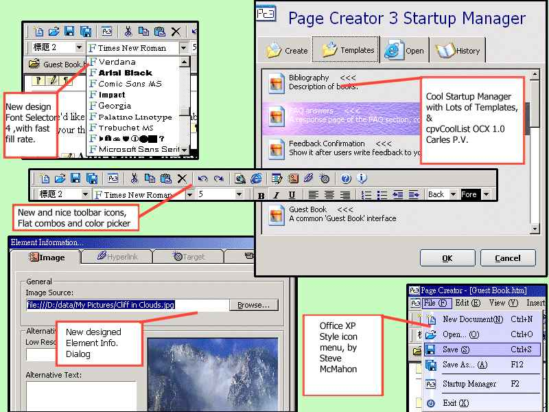



## A big work:Alphasoft Page Creator 3 Revolt\(Beta 1\.2\)

### Description

PAGE CREATOR 3!!! (With: Very Cool Customizeable Menu with icons and background bitmap, Flat version of my Font Selector, Color Picker, and Flat combo box, buttons, HTML Syntax Highlighting, Startup Manager, Web Page Templates...) See more! The Page Creator Series is a powerful WYSIWYG Web Page Creator, with real time preview editing environment, HTML code editor with syntax highlighting, Dynamic action when editing your page, and many many cool functions. You must see it if you want to see what a "Big" application is.
 
### More Info
 

             |
---                |---
**Submitted On**   |
**By**             |[Kenny Lai, Lai Ho Wa](https://github.com/Planet-Source-Code/PSCIndex/blob/master/ByAuthor/kenny-lai-lai-ho-wa.md)
**Level**          |Advanced
**User Rating**    |4.7 (191 globes from 41 users)
**Compatibility**  |VB 6\.0
**Category**       |[Complete Applications](https://github.com/Planet-Source-Code/PSCIndex/blob/master/ByCategory/complete-applications__1-27.md)
**World**          |[Visual Basic](https://github.com/Planet-Source-Code/PSCIndex/blob/master/ByWorld/visual-basic.md)
**Archive File**   |

### Source Code

!!!<<<
This is a beta only, and it's never finished. Please don't tweak it as a
completed program.>>>!!!

In this version of <b>Page Creator 3 Revolt</b>,

<ul>
 <li>
 
<b>XP Style Icon Menu</b>

 <li>
 
<b>Nice startup manager, with lots of
 templates, and a cool list box</b>

 </li>
 <li>
 
Fully worked <b>Flat Controls</b>,
 included <b>Combo Box, Listbox, Buttons and more</b>...

 <li>
 
My great controls, the <b>Flat version of
 Font Selector 4, and a Flat Drop-Down Color Picker</b>

 <li>
 
User friendly editing environment

 </li>
 <li>
 
Greatly improved
 performance!!!!!!

 </li>
 <li>
 
Good Tab system

 </li>
 <li>
 
Fully worked File system

 </li>
 <li>
 
Nice new toolbar icons

 </li>
 <li>
 
Always-on-top Toolbox

 </li>
 <li>
 
Excellent HTML syntax
 highlighter by CodeMax Control

 </li>
 <li>
 
New designed Element information
 dialog

 </li>
 <li>
 
Lot's of FUN!

 </li>
</ul>

<a href="http://pcseries.sourceforge.net/pscode/pc3.zip">Download
Here</a>

@

